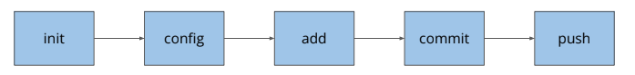
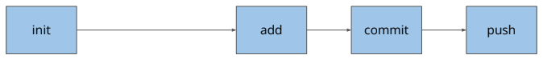

# Lesson 2

`I. Verion Control System`

- VCS: Hệ thống quản lý các phiên bản
- 3 loại:
  1. **Local**: Lưu ở máy cá nhân
  2. **Centralize**: Lưu ở một máy chủ tập trung
  3. **Distributed**: Lưu ở nhiều máy khác nhau

`II. Git`

**1. So sánh Git & GitHub**

    - Git: là phần mềm, commandline tool được cài trên máy cá nhân
    - GitHub: là website, công cụ để upload git repository lên

**2. Ba trạng thái của Git**

    - Working Directory: các file mới hoặc file có thay đổi
    - Staging Area: các file đưa vào vùng chuẩn bị commit
    - Repository: các commit

**3. Key takeaways**

    - git init: Khởi tạo thư mục quản lý bởi git
    - git add <file_name>: Thêm file được chọn vào vùng staging
    - git add . : Thêm toàn bộ file vào vùng staging
    - git commit -m "message": Thêm những file ở vùng staging vào vùng repository
    - git status:  Xem trạng thái file -> đỏ - vùng working directory, xanh - vùng staging
    - git log: Kiểm tra lịch sử commit

**4. Simple Workflow**

- **Không dùng global config**
  
- **Dùng global config**
  

**5. Commit Convention**

- Cú pháp: type: short_description
- type:
  1. chore: sửa nhỏ lẻ, chính tả, xóa file không dùng tới,...
  2. feat: thêm tính năng mới, test case mới
  3. fix: sửa lỗi 1 test trước đó
- short_description: mô tả ngắn gọn (50 kí tự), tiếng Anh hoặc tiếng Việt không dấu.

`III. Javascript`

**1. Ghi vào dòng**

    console.log("");

**2. Variable - Biến**

    Dùng để lưu trữ giá trị có thể thay đổi giá trị được

var: phạm vi toàn cục (global)

let: phạm vi trong cặp ngoặc {}

    Khai báo:
        var <ten_bien> = <gia tri>;
        let <ten_bien> = <gia tri>;

**3. Constant - Hằng số**

    Dùng để khai báo các giá trị không thay đổi
    const <name> = <value>

**4. Datatype - Kiểu dữ liệu**

    Có 8 loại kiểu dữ liệu: String, Number, Bigint, Boolean, Undefined, Null,Symbol, Object.

**5. Comparision Operator**

    So sánh hơn kém: >, <
    So sánh bằng: ==, ===,!=, !==, >=, <=

**6. Unary Operator**

    Dùng để tăng hoặc giảm giá trị
    - i++ bằng với i=i+1
    - i-- bằng với i=i-1

**7. Arithmetic Operator**

    Dùng tính toán giá trị biểu thức
    Các phép toán: +, -, *, /

**8. Conditional**

    Dùng để kiểm tra có nên thực hiện một đoạn logic không.
    Cú pháp: if (<điều kiện>) { //code }. Nếu điều kiện đúng, sẽ chạy đoạn code

**7. Loops**

    Dùng để thực hiện một đoạn logic một số lần nhất định
    Cú pháp: for(<khởi tạo>; <điều kiện dừng>; <điều kiện tăng>) {//code }

`IV. Format Code`

    - Mac: Option + Shift + F
    - Window: Alt + Shift + F